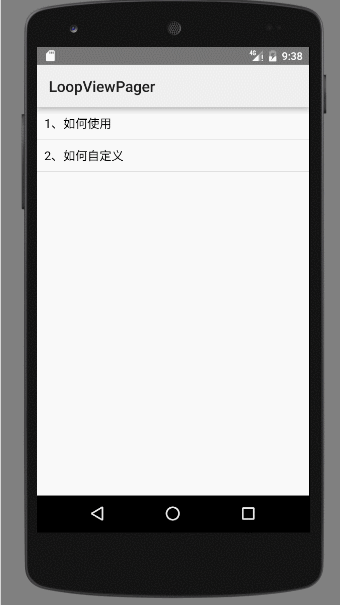

# LoopViewPager
Android LoopViewPager 页面轮播控件
* 简 书：http://www.jianshu.com/p/f847325e8a28
* CSDN：http://www.jianshu.com/p/f847325e8a28
#添加权限
```xml
    <uses-permission android:name="android.permission.INTERNET" />
    <uses-permission android:name="android.permission.READ_EXTERNAL_STORAGE" />
    <uses-permission android:name="android.permission.WRITE_EXTERNAL_STORAGE" />
    <uses-permission android:name="android.permission.ACCESS_NETWORK_STATE" />
```

#添加依赖
```xml
allprojects {
    repositories {
        ...
        maven { url "https://jitpack.io" }
    }
}

dependencies {
    compile 'com.github.open-android:LoopViewPager:1.0.0'
}
```

#可配置的属性
```xml
    <declare-styleable name="LoopViewPager">
        <!-- 轮播时间，默认值0表示不自动轮播 -->
        <attr name="loopTime" format="integer" />
        <!-- 动画时间 -->
        <attr name="animTime" format="integer" />
        <!-- 动画效果 -->
        <attr name="animStyle" format="enum">
            <!-- 折叠效果 -->
            <enum name="accordion" value="1" />
            <enum name="accordionUp" value="2" />
            <!-- 立方体效果 -->
            <enum name="cube" value="3" />
            <enum name="cubeUp" value="4" />
        </attr>
        <!-- 是否可以手动滚动页面，默认true -->
        <attr name="scrollEnable" format="boolean" />
        <!-- 触摸页面是否停止轮播，默认true -->
        <attr name="touchEnable" format="boolean" />
    </declare-styleable>
    <declare-styleable name="LoopDotsView">
        <!-- 圆点大小 -->
        <attr name="dotSize" format="integer|dimension|reference" />
        <!-- 圆点宽度 -->
        <attr name="dotWidth" format="integer|dimension|reference" />
        <!-- 圆点高度 -->
        <attr name="dotHeight" format="integer|dimension|reference" />
        <!-- 圆点距离 -->
        <attr name="dotRange" format="integer|dimension|reference" />
        <!-- 圆点形状 -->
        <attr name="dotShape">
            <!-- 矩形，默认值 -->
            <enum name="rectangle" value="1" />
            <!-- 圆形 -->
            <enum name="oval" value="2" />
            <!-- 三角形 -->
            <enum name="triangle" value="3" />
            <!-- 菱形 -->
            <enum name="diamond" value="4" />
        </attr>
        <!-- 圆点颜色，默认值0xFFFFFFFF -->
        <attr name="dotColor" format="color|reference" />
        <!-- 圆点选中颜色，默认值0x55000000 -->
        <attr name="dotSelectColor" format="color|reference" />
        <!-- 圆点资源 -->
        <attr name="dotResource" format="reference" />
        <!-- 圆点选中资源 -->
        <attr name="dotSelectResource" format="reference" />
    </declare-styleable>
```
#配置说明
- 1、loopTime的值应不小于1s，如果值为0，则不自动轮播；
- 2、animTime的值应小于loopTime；
- 3、dotWidth、dotHeight、dotRange如果没有设置，则默认值为dotSize；
- 4、如果设置了dotResource、dotSelectResource，则dotShape、dotColor、dotSelectColor配置不生效；
- 5、轮播调用start()方法，停止轮播调用stop()方法，start前至少设置setImgData、setImgLength、setTitleData中的其中一个；

#代码示例
###XML
```xml
    <com.itheima.loopviewpager.LoopViewPager
        android:id="@+id/lvp_pager"
        android:layout_width="match_parent"
        android:layout_height="200dp"
        app:animStyle="accordion"
        app:animTime="1000"
        app:loopTime="3000">

        <LinearLayout
            android:layout_width="match_parent"
            android:layout_height="wrap_content"
            android:layout_gravity="bottom"
            android:background="#55000000"
            android:gravity="center"
            android:orientation="horizontal"
            android:padding="10dp">

            <com.itheima.loopviewpager.LoopTitleView
                android:layout_width="0dp"
                android:layout_height="wrap_content"
                android:layout_weight="1"
                android:maxLines="1"
                android:textColor="#FF0000"
                android:textSize="16sp" />

            <com.itheima.loopviewpager.LoopDotsView
                android:layout_width="wrap_content"
                android:layout_height="wrap_content"
                android:layout_marginLeft="10dp"
                app:dotShape="oval"
                app:dotSize="10dp" />

        </LinearLayout>

    </com.itheima.loopviewpager.LoopViewPager>
```
###Java
```java
    private LoopViewPager loopViewPager;

    @Override
    protected void onCreate(Bundle savedInstanceState) {
        super.onCreate(savedInstanceState);
        setContentView(R.layout.activity_simple_demo2);
        loopViewPager = (LoopViewPager) findViewById(R.id.lvp_pager);
        loopViewPager.setImgData(DataFactory.imgListString());
        loopViewPager.setTitleData(DataFactory.titleListString());
        loopViewPager.start();
    }

    private List<String> imgListString() {
        List<String> imageData = new ArrayList<>();
        imageData.add("http://d.hiphotos.baidu.com/image/h%3D200/sign=72b32dc4b719ebc4df787199b227cf79/58ee3d6d55fbb2fb48944ab34b4a20a44723dcd7.jpg");
        imageData.add("http://pic.4j4j.cn/upload/pic/20130815/31e652fe2d.jpg");
        imageData.add("http://pic.4j4j.cn/upload/pic/20130815/5e604404fe.jpg");
        imageData.add("http://pic.4j4j.cn/upload/pic/20130909/681ebf9d64.jpg");
        imageData.add("http://d.hiphotos.baidu.com/image/pic/item/54fbb2fb43166d22dc28839a442309f79052d265.jpg");
        return imageData;
    }

    private List<String> titleListString() {
        List<String> titleData = new ArrayList<>();
        titleData.add("1、在这里等着你");
        titleData.add("2、在你身边");
        titleData.add("3、打电话给你就是想说声“嗨”");
        titleData.add("4、不介意你对我大喊大叫");
        titleData.add("5、期待你总是尽全力");
        return titleData;
    }
```
#如何自定义
```java
public class SimpleDemo2 extends AppCompatActivity {

    private List<View> viewList;
    private LoopViewPager loopViewPager;

    @Override
    protected void onCreate(Bundle savedInstanceState) {
        super.onCreate(savedInstanceState);
        setContentView(R.layout.activity_simple_demo2);
        loopViewPager = (LoopViewPager) findViewById(R.id.lvp_pager);
        initData();

        // 自定义View
        loopViewPager.setOnCreateItemViewListener(new OnCreateItemViewListener() {
            @Override
            public View getItemView(int position) {
                return viewList.get(position);
            }
        });
        //处理点击事件
        loopViewPager.setOnItemClickListener(new OnItemClickListener() {
            @Override
            public void onItemClick(View view, int position) {
                Toast.makeText(SimpleDemo2.this, "position=" + position, Toast.LENGTH_SHORT).show();
            }
        });
        // 自定义动画
        loopViewPager.setPageTransformer(1500, new LoopVerticalTransformer() {
            @Override
            public void transformViewPage(View view, float position) {
                view.setPivotX(view.getMeasuredWidth() * 0.5f);
                view.setPivotY(position <= 0 ? view.getMeasuredHeight() : 0);
                view.setRotationX(-90f * position);
            }
        });
        loopViewPager.setImgLength(viewList.size());
//        loopViewPager.setTitleData(DataFactory.titleListString());
        loopViewPager.start();
    }

    private void initData() {
        viewList = new ArrayList<>();
        for (int i = 1; i <= 5; i++) {
            View view = null;
            if (i == 2) {
                ImageView imageView = new ImageView(this);
                Glide.with(SimpleDemo2.this).load("http://pic.58pic.com/58pic/13/72/07/55Z58PICKka_1024.jpg").centerCrop().into(imageView);
                view = imageView;
            } else if (i == 4) {
                ImageView imageView = new ImageView(this);
                Glide.with(SimpleDemo2.this).load("http://www.bz55.com/uploads/allimg/120615/1-120615140A8.jpg").centerCrop().into(imageView);
                view = imageView;
            } else {
                TextView textView = new TextView(this);
                textView.setGravity(Gravity.CENTER);
                textView.setTextColor(Color.BLUE);
                textView.setTextSize(36);
                textView.setText("TextView " + i);
                textView.setBackgroundColor(Color.rgb(new Random().nextInt(255), new Random().nextInt(255), new Random().nextInt(255)));
                view = textView;
            }
            viewList.add(view);
        }
    }

    @Override
    protected void onDestroy() {
        super.onDestroy();
        loopViewPager.stop();
    }

}
```
#运行效果


#最低版本
v14+


[回到顶部](#readme)
